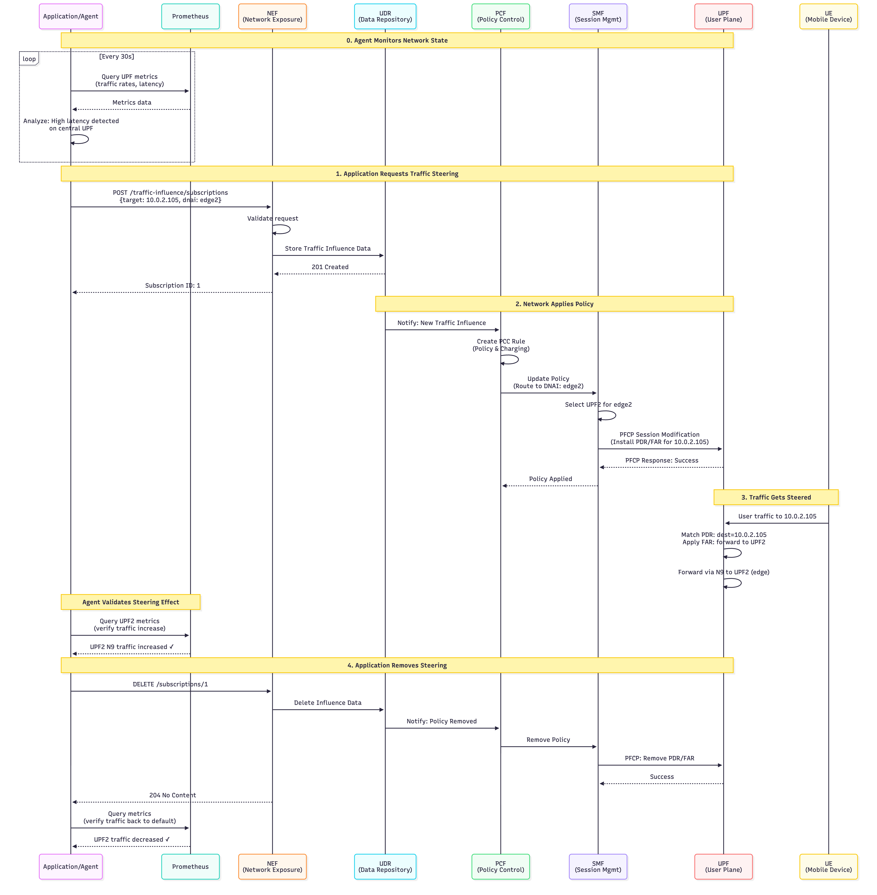
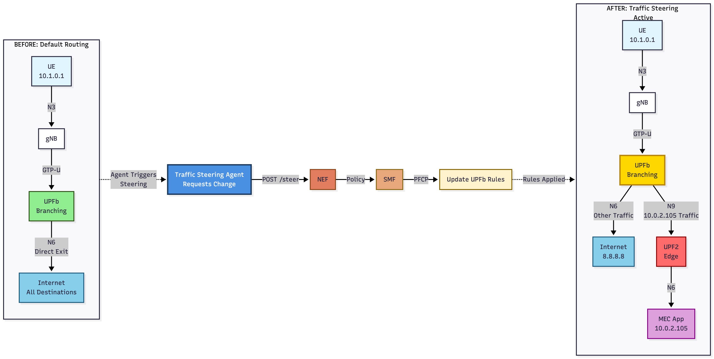

# 5G Autonomous Traffic Steering Agent

**An Intelligent 5G Network with Automated Traffic Routing and LLM Integration (In Development)**

This project demonstrates an autonomous 5G traffic steering system that monitors network metrics and makes intelligent routing decisions through standard 3GPP APIs. The system uses **free5GC v3.4.5** as the 5G core with ULCL topology, **Prometheus** for real-time metrics collection, and **NEF (Network Exposure Function)** to dynamically apply Traffic Influence policies.

This lab is built based on the free5GC traffic steering tutorials:
- [Traffic Steering Demo Setup](https://free5gc.org/blog/20250416/20250416/)
- [Traffic Steering Lab Guide](https://free5gc.org/blog/20250625/20250625/)

**Current Status:**
- ✅ **Working Version**: Rule-based traffic steering with automatic threshold detection
- 🚧 **In Development**: LLM-driven decision making using Ollama (Qwen3)

The working agent monitors traffic every 30 seconds and automatically steers users to less congested edge UPFs when traffic exceeds configurable thresholds. LLM integration is being developed to enable natural language interpretation of complex network scenarios.

## 🎯 Key Features

- **Automated Traffic Steering**: Monitors UPFB traffic every 30 seconds and automatically steers to less congested edge when threshold (100 KB/s) is exceeded
- **ULCL Topology**: Implements Uplink Classifier with branching and anchor UPFs for flexible traffic routing
- **Standard 3GPP APIs**: Uses NEF Traffic Influence API to apply steering policies via standard interfaces
- **Prometheus Integration**: Real-time metrics collection from all UPF instances with custom exporters
- **Grafana Dashboard**: Visualizes traffic rates, steering decisions, active policies, and network topology
- **Rule-Based Logic**: Intelligent threshold detection and load balancing between edges
- **Kubernetes-Native**: Full deployment on MicroK8s with Helm charts
- **🚧 LLM Integration** (Coming Soon): Ollama/Qwen3 for natural language decision making

## System Overview and Agent Workflow

The system implements a **ULCL (Uplink Classifier)** topology with intelligent traffic steering. The agent continuously monitors network metrics and makes automated steering decisions through the NEF API.




### Core Components

| Component | Description | Version |
|-----------|-------------|---------|
| **free5GC** | 5G Core Network (AMF, SMF, UPF, NEF, etc.) | v3.4.5 |
| **UERANSIM** | 5G UE/gNB Simulator | v3.2.7 |
| **Prometheus** | Metrics collection and storage | Latest |
| **Ollama** | LLM inference engine | Latest |
| **LLM Model** | Qwen3 for decision making | 4.7B params |
| **Traffic Steering Agent** | Python agent with smolagents framework | Custom |
| **Grafana** | Metrics visualization | Latest |
| **MicroK8s** | Kubernetes distribution | v1.28+ |

## 📋 Prerequisites

### Infrastructure Requirements

- **3 Virtual Machines** (via Vagrant or manual setup):
  - `ns` (192.168.56.119): MicroK8s primary node - hosts 5GC, Prometheus, Grafana, Traffic Agent
  - `ns2` (192.168.56.120): MicroK8s worker node - additional UPF capacity
  - `vm3` (192.168.56.121): UERANSIM node - gNB and UE simulator


- **Host Machine**:
  - Ollama installed and running
  - Docker for building images
  - 16GB+ RAM recommended
  - 50GB+ disk space

### Software Requirements

```bash
# On MicroK8s nodes (ns, ns2)
- MicroK8s with addons: dns, registry, storage
- Helm 3.x

# On UERANSIM node (vm3)
- UERANSIM built from source
- GTP5G kernel module

# On host machine
- Ollama with qwen3 model pulled
- Docker
- MongoDB client (for policy inspection)
- Vagrant (if using VM setup)
```

## 🚀 Quick Start

### 1. Setup Infrastructure

If using Vagrant (recommended for testing):

```bash
cd vagrant
vagrant up
```

This creates 3 VMs with proper networking configured.

### 2. Install Ollama and Pull Model

On your **host machine**:

```bash
# Install Ollama
curl -fsSL https://ollama.com/install.sh | sh

# Pull the Qwen3 model
ollama pull qwen3

# Verify it's running
curl http://localhost:11434/api/tags
```

The agent will connect to Ollama at `http://192.168.0.128:11434` (update in deployment YAML if different).

### 3. Deploy free5GC with ULCL Topology

```bash
# Clone the repository
git clone https://github.com/kimagliardi/traffic-steering.git
cd traffic-steering

# SSH to MicroK8s primary node
vagrant ssh ns

# Create namespace
microk8s kubectl create namespace free5gc

# Deploy free5GC using ULCL-enabled Helm chart
microk8s helm install -n free5gc free5gc-v1 \
  /home/ubuntu/free5gc-helm/charts/free5gc \
  -f /home/ubuntu/free5gc-helm/charts/free5gc/ulcl-enabled-values.yaml
```

**ULCL Configuration**: The `ulcl-enabled-values.yaml` defines:
- **UPFB** (10.100.50.241): Branching UPF that receives traffic from gNB
- **UPFB2** (10.100.50.242): Secondary branching UPF for slice 2
- **UPF1** (10.100.50.243): Edge1 anchor UPF
- **UPF2** (10.100.50.245): Edge2 anchor UPF

### 4. Deploy Prometheus

```bash
# Install Prometheus for metrics collection
microk8s helm install -n free5gc prometheus \
  /home/ubuntu/free5gc-helm/charts/prometheus
```

Prometheus scrapes UPF metrics every 10 seconds via the `/metrics` endpoint.

### 5. Build and Deploy Traffic Steering Agent


```bash
# On your host machine
cd traffic-steering/agent

# Build the Docker image
docker build -f Dockerfile.llm -t localhost:32000/traffic-steering-agent:v3 .

# Save and transfer to MicroK8s node
docker save localhost:32000/traffic-steering-agent:v3 | gzip > agent-v3.tar.gz
scp -F ../vagrant/ssh_config agent-v3.tar.gz ns:/tmp/

# Import into MicroK8s
vagrant ssh ns
gunzip -c /tmp/agent-v3.tar.gz | microk8s ctr --namespace k8s.io images import -

# Deploy the agent
microk8s kubectl apply -f /home/ubuntu/agent/agent-deployment.yaml
```

**Agent Configuration** (via environment variables in deployment):
- `OLLAMA_API_BASE`: http://192.168.0.128:11434
- `LLM_MODEL`: qwen3
- `PROMETHEUS_URL`: http://prometheus-prometheus.free5gc.svc.cluster.local:9090
- `NEF_URL`: http://free5gc-v1-free5gc-nef-service.free5gc.svc.cluster.local:80
- `STEERING_INTERVAL`: 30 (seconds between checks)
- `TRAFFIC_THRESHOLD_KB`: 100 (KB/s threshold to trigger steering)

### 6. Deploy UERANSIM

```bash
# SSH to UERANSIM VM
vagrant ssh vm3

# Start gNB (base station simulator)
cd ~/ue/UERANSIM
sudo ./build/nr-gnb -c config/free5gc-gnb.yaml &

# Start UE (phone simulator)
sudo ./build/nr-ue -c config/free5gc-ue.yaml &
```

The UE should register with the 5G core and create a `uesimtun0` interface.

### 7. Deploy Grafana Dashboard (Optional)

```bash
# Port-forward Grafana
microk8s kubectl port-forward -n free5gc svc/grafana 3000:80 --address 0.0.0.0 &

# Import dashboard from agent/grafana-dashboard.json
# Access at http://192.168.56.119:3000
```

## 🎬 Demo: Watch the agent in Action

### Demo Videos

<video src="demos/demo_llm.webm" controls></video>

*LLM-based traffic steering in action*

<video src="demos/demo1.webm" controls></video>

*Demo 1: Initial traffic steering scenario*

<video src="demos/demo2.webm" controls></video>

*Demo 2: Traffic rebalancing between edges*

### Scenario: Automatic Traffic Steering Based on Load

The traffic steering agent monitors UPFB traffic every 30 seconds and uses the LLM to make intelligent decisions.



#### Initial State
- No traffic policies active
- UE connected via UPFB → default routing

#### Trigger: Generate High Traffic
```bash
# SSH to UERANSIM VM
vagrant ssh vm3

# Generate traffic exceeding 100 KB/s threshold
curl --interface uesimtun0 -o /dev/null http://speedtest.tele2.net/100MB.zip
```

#### LLM Decision Process

The agent queries Prometheus for current traffic rates:
- **UPFB Traffic**: 4862.5 KB/s (exceeds 100 KB/s threshold)
- **Edge1 Traffic**: 0 KB/s
- **Edge2 Traffic**: 0 KB/s
- **Active Policy**: none

The LLM receives this prompt:
```
You are a 5G traffic steering expert. Analyze these metrics and decide whether to steer traffic.

METRICS:
- Edge1 traffic: 0.00 KB/s
- Edge2 traffic: 0.00 KB/s
- UPFB traffic: 4862.50 KB/s
- Active policy: none
- Threshold: 100.00 KB/s

RULES:
1. If no policy exists and UPFB > threshold: steer to edge with LOWER traffic (if equal, choose edge1)
2. If policy exists and that edge > threshold: rebalance to other edge (if 20% less traffic)
3. Otherwise: no action needed

IMPORTANT: If UPFB traffic exceeds threshold and no policy exists, you MUST choose edge1 or edge2, NOT none!

Your decision:
```

**LLM Response**: `edge1`

#### Agent Action

The agent creates a Traffic Influence policy via NEF API:

```json
POST http://free5gc-v1-free5gc-nef-service/3gpp-traffic-influence/v1/af001/subscriptions
{
  "afServiceId": "TrafficSteeringAgent",
  "afAppId": "af001",
  "dnn": "internet",
  "snssai": {
    "sst": 1,
    "sd": "010203"
  },
  "trafficRoutes": [
    {
      "dnai": "edge1",
      "routeInfo": {
        "ipv4Addr": "10.100.50.243"
      }
    }
  ]
}
```

#### Result

✅ **Traffic successfully steered to edge1!**

- SMF receives the policy from NEF
- SMF updates UPFB routing rules via PFCP
- Subsequent UE traffic flows through UPFB → UPF1 (edge1)
- Grafana dashboard shows active policy and traffic split

### Viewing Logs

```bash
# Watch agent making LLM decisions
microk8s kubectl logs -n free5gc -l app=traffic-steering-agent -f

# Sample output:
# 🔍 Traffic rates: UPFB=4862.5 KB/s, edge1=0.0 KB/s, edge2=0.0 KB/s
# 🤖 Asking LLM for decision...
# 🤖 LLM decision: STEER_TO_EDGE1 (response: edge1)
# ✅ Traffic steered to edge1
# 📊 Active policy: edge1
```

## Running the Demo

### Scenario

We will simulate a user watching a video (Low Bandwidth) who then starts a massive download (High Bandwidth). The AI should detect this and move them to the Edge.

### Step 1: Start the UE (Cloud Path)

SSH into your UERANSIM machine and start the UE. By default, it routes to the Cloud UPF (192.168.56.121).

```bash
# Verify initial route (Should be Cloud IP)
ping -I uesimtun0 8.8.8.8
```

### Step 2: Generate Traffic (The Trigger)

Start a low-bandwidth stream. The Agent sees this but takes no action (Load < 10Mbps).

```bash
iperf3 -c <LAPTOP_IP> -B 10.1.0.1 -u -b 5M -t 60
```

### Step 3: The Spike (AI Activation)

Increase the load to trigger the threshold (>10Mbps).

```bash
iperf3 -c <LAPTOP_IP> -B 10.1.0.1 -u -b 25M -t 60
```

Open Grafana and check the **Traffic Steering Agent Dashboard** to observe:
- Traffic spike in real-time
- Agent decision-making process
- Policy changes and steering actions
- Traffic distribution across UPFs

### Step 4: Verify Traffic Shift

You must restart the UE process (nr-ue) to force the PDU Session to pick up the new policy (in a lab environment).
Once restarted, check the traffic flow on the Edge UPF node:

```bash
sudo tcpdump -i any dst 192.168.56.122 -n
```

You will see packets flowing to the Edge IP instead of the Cloud IP.

## Troubleshooting

### SMF Crash (context deadline exceeded)

This means the SMF config defines UPFs that do not exist in the cluster. Check `kubectl get pods` to ensure you have enough UPF instances running to match your `ulcl-values.yaml`.

### NEF Error (AF not found)

The Agent ID (SmartAgent) is not authorized. Restart the NEF pod to reload the ConfigMap:

```bash
kubectl rollout restart deployment/free5gc-v1-free5gc-nef-nef
```

### Traffic doesn't switch

Did you restart the UE? The PCF pushes rules during Session Establishment. Toggling "Airplane Mode" (restarting nr-ue) is required to apply the new route instantly in this lab setup.
